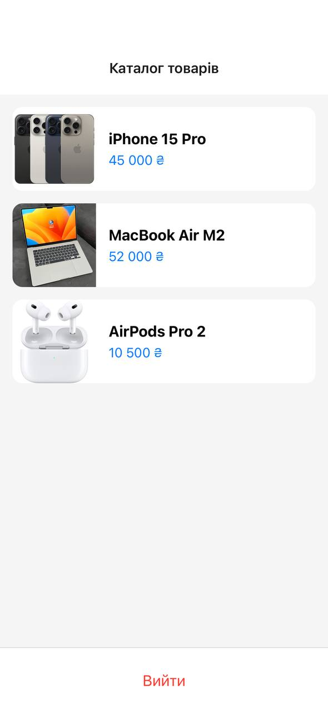

# Лабораторна робота №5: Навігація в React Native за допомогою Expo Router

## 1. Інструкція запуску
Для запуску проєкту виконайте наступні кроки:

1.  **Встановлення залежностей:**
    ```bash
    npm install
    ```
2.  **Запуск сервера розробки:**
    ```bash
    npm run start
    ```
3.  **Запуск на пристрої:**
    *   Відскануйте QR-код за допомогою застосунку **Expo Go** (Android) або камери (iOS).
    *   Або натисніть `a` для Android емулятора чи `i` для iOS симулятора.

---

## 2. Опис реалізованого функціоналу
У проєкті реалізовано мобільний застосунок для перегляду каталогу товарів з системою авторизації:

*   **Глобальний AuthContext:** Керує станом авторизації (`isAuthenticated`) та імітує базу даних користувачів.
*   **Захищена навігація:** Використано групу маршрутів `(app)` з перевіркою доступу. Неавторизовані користувачі автоматично перенаправляються на сторінку входу.
*   **Реєстрація та Вхід:** Користувач може створити акаунт, дані якого зберігаються в пам'яті застосунку на час сесії.
*   **Каталог товарів:** Відображення списку товарів за допомогою `FlatList`.
*   **Динамічні маршрути:** Сторінка детальної інформації про кожен товар (`/details/[id]`).
*   **Обробка помилок:** Реалізовано кастомний екран "404 - Сторінка не знайдена".

---

## 3. Скріншоти роботи застосунку

| Вхід | Реєстрація | Каталог | Деталі |
| :---: | :---: | :---: | :---: |
|  |  |  |  |

---

## 4. Висновки (Відповіді на контрольні запитання)

1.  **Яким чином за допомогою Expo Router реалізується перенаправлення неавторизованого користувача?**
    Перенаправлення реалізується в файлі `_layout.jsx` захищеної групи. Використовується компонент `<Redirect href="/login" />`, який спрацьовує, якщо глобальний стан `isAuthenticated` дорівнює `false`.

2.  **У чому полягає різниця між використанням компонента `<Link>` та метода `router.push()`?**
    *   `<Link>` — це декларативний підхід, схожий на `<a>` в HTML. Він кращий для SEO (на вебі) та доступності.
    *   `router.push()` — це програмний підхід. Його використовують всередині функцій (наприклад, після успішної відправки форми), коли потрібно виконати логіку перед переходом.

3.  **Як працюють динамічні маршрути в Expo Router і як отримати передані параметри?**
    Динамічні маршрути створюються шляхом назви файлу в квадратних дужках, наприклад `[id].jsx`. Для отримання параметрів (наприклад, `id` товару) використовується хук `useLocalSearchParams()` всередині компонента екрана.

4.  **Чому стан авторизації доцільно зберігати у глобальному контексті (React Context), а не в локальному стані компонента?**
    Стан авторизації потрібен усьому застосунку (для захисту роутів, відображення профілю, виходу з акаунту). Глобальний контекст дозволяє уникнути "prop drilling" (прокидання пропсів через всі рівні) і забезпечує єдине джерело істини для всіх екранів.

5.  **Для чого використовуються групи маршрутів `(folderName)` і як вони впливають на URL-адресу?**
    Групи маршрутів використовуються для логічного розділення частин застосунку (наприклад, `(auth)` для входу та `(app)` для основного контенту). Назву папки в дужках Expo Router ігнорує при побудові URL, тому шлях до `app/(auth)/login.jsx` буде просто `/login`.
